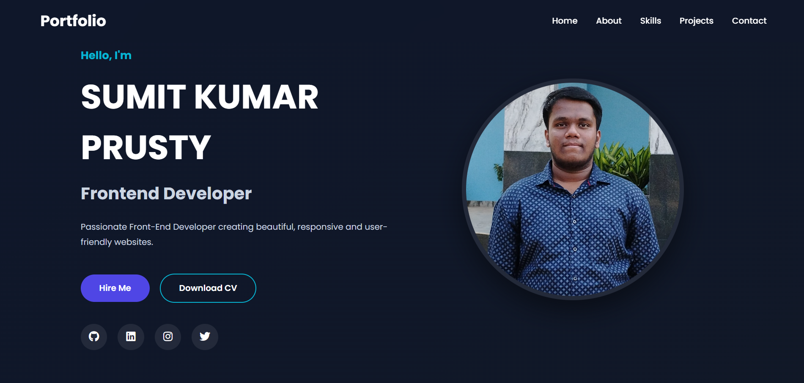
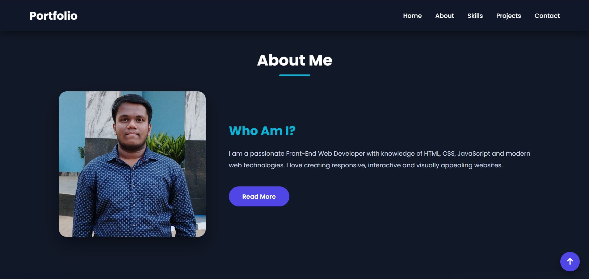
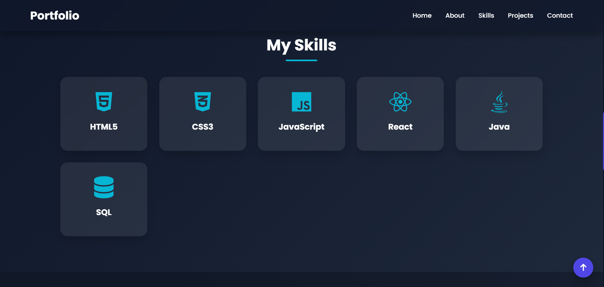
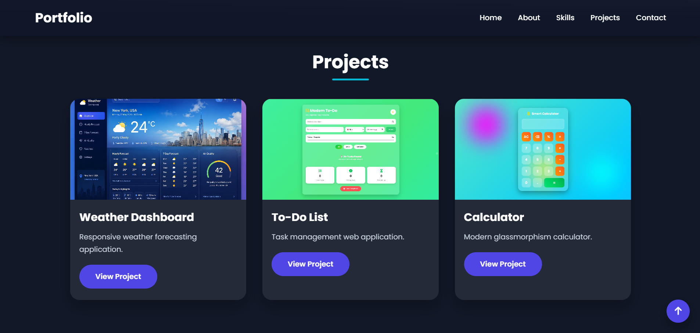
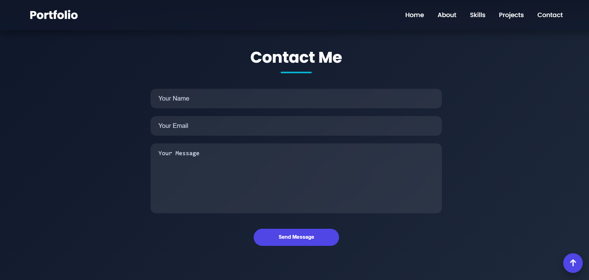

# 🌐 Personal Portfolio Website

A modern, responsive, and interactive **Personal Portfolio Website** built using **HTML5, CSS3, and JavaScript**. This portfolio showcases my skills, projects, education, achievements, and contact information with a clean and professional user interface.

---

## 🚀 Features

- 🎨 Modern & Responsive Design
- 👤 Hero Section
- 📖 About Me Section
- 💻 Skills Showcase
- 📂 Projects Gallery
- 📄 Resume Download Button
- 📞 Contact Form
- 🔗 Social Media Links
- 📱 Mobile Friendly
- ✨ Smooth Scrolling
- 🎯 Typing Animation
- 📌 Sticky Navigation Bar
- ⬆️ Scroll-to-Top Button
- 🎭 CSS Animations
- 🌙 Glassmorphism UI

---

## 🛠️ Technologies Used

- HTML5
- CSS3
- JavaScript (ES6)
- Font Awesome
- Google Fonts

---

## 📂 Project Structure

```text
Personal-Portfolio-Website/
│
├── index.html
├── style.css
├── script.js
├── README.md
├── LICENSE
│
├── images/
│   ├── profile.jpg
│   ├── about.jpg
│   ├── project1.png
│   ├── project2.png
│   ├── project3.png
│   ├── hero.png
│   ├── bg.jpg
│   ├── home.png
│   ├── skills.png
│   ├── projects.png
│   └── contact.png
│
└── resume/
    └── resume.pdf
```

---

## 📸 Screenshots

### 🏠 Home



### 👤 About



### 💻 Skills



### 📂 Projects



### 📞 Contact



---

## ⚙️ Installation

### Clone the Repository

```bash
git clone https://github.com/yourusername/Personal-Portfolio-Website.git
```

### Navigate to the Project Folder

```bash
cd Personal-Portfolio-Website
```

### Run the Project

Open **index.html** in your browser

**OR**

Use the **Live Server** extension in Visual Studio Code.

---

## 🎯 Learning Outcomes

- Semantic HTML5
- CSS Flexbox & Grid
- Responsive Web Design
- JavaScript DOM Manipulation
- UI/UX Design
- CSS Animations
- Git & GitHub

---

## 🚀 Future Improvements

- 🌙 Dark/Light Mode
- 📧 EmailJS Contact Form
- 🌐 Multi-language Support
- 📊 GitHub Statistics
- 📝 Blog Section
- 🔍 Project Search & Filter
- 🤖 AI Chatbot
- ⚡ Performance Optimization

---

## 🤝 Contributing

Contributions are welcome!

1. Fork this repository
2. Create a feature branch
3. Commit your changes
4. Push to your branch
5. Create a Pull Request

---

## 📄 License

This project is licensed under the **MIT License**.

---

## 👨‍💻 Author

**Sumit Kumar Prusty**


## 🙏 Acknowledgements

- Google Fonts
- Font Awesome
- Open Source Community

---

# Thank You ❤️

If you found this project helpful, don't forget to **Star ⭐ the repository**.

Happy Coding! 🚀
